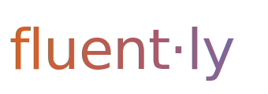

<p align="center">
  
</p>

# The Open Standard for Human-AI Collaboration

[](https://www.npmjs.com/package/fluently-cli)
[](https://www.npmjs.com/package/fluently-mcp-server)
[](https://github.com/Fluently-Org/fluently/actions/workflows/ci.yml)
[](LICENSE)
[](https://github.com/Fluently-Org/fluently/stargazers)
[](https://modelcontextprotocol.io)
[](https://fluently-org.github.io/fluently/)

---

## What is Fluently?

AI is powerful but not magic. The gap between good and poor AI-assisted work is not the model — it is the collaboration. Fluently is an open platform that operationalizes **human-AI collaboration frameworks** as a shared knowledge commons, a scoring engine, a CLI, and an MCP server.

Fluently ships with the **AI Fluency 4D Framework** by Dakan & Feller (Delegation, Description, Discernment, Diligence) as its bundled standard. Any framework with named dimensions can be registered alongside it, enabling teams to benchmark the same task across multiple frameworks and choose the one that fits their context.

**Agent-agnostic.** Works with Claude, GPT, Gemini, Mistral, Copilot, and any MCP-compatible client.

**Framework-agnostic.** Start with 4D. Bring your own framework. Compare them side by side.

---

## See It in Action

**Real-world example:** Compare your code review process against community best practices:

```bash
$ fluent compare --task "Automated code review with human sign-off"

┌─────────────────────────────────────────────────────────┐
│ TOP 3 MATCHING CYCLES FROM THE KNOWLEDGE BASE           │
├─────────────────────────────────────────────────────────┤
│ 1. Code Review: Review Depth vs. Speed Tradeoffs        │
│    Delegation: 75  Description: 82  Discernment: 78     │
│    Diligence: 71   OVERALL: 76/100                      │
│                                                         │
│ 2. Bug Fix Prioritization                               │
│    Delegation: 68  Description: 74  Discernment: 71     │
│    Diligence: 69   OVERALL: 71/100                      │
│                                                         │
│ 3. Test Case Generation                                 │
│    Delegation: 72  Description: 76  Discernment: 70     │
│    Diligence: 68   OVERALL: 72/100                      │
└─────────────────────────────────────────────────────────┘
```

Each result links to the full cycle: delegation guidelines, framing prompts, hallucination patterns to watch for, and approval workflows.

---

## Install in 30 Seconds

**Option 1 — Zero install (browser):** Use the [live scorer](https://fluently-org.github.io/fluently/) right now. No setup required.

**Option 2 — Zero install (terminal):** Run instantly with npx, no PATH changes needed:
```bash
npx fluently-cli score "Automated bug triage with human review"
```

**Option 3 — Permanent install:**
```bash
npm install -g fluently-cli
fluent --help
```

Requires Node.js 20+. The CLI is self-contained, no configuration files needed.

---

## What's Inside

**CLI** — Run `fluent` in your terminal to score workflows, compare against community cycles, and contribute new patterns across any registered framework.

**MCP Server** — Embed collaboration scoring into any AI agent or MCP-compatible client (VS Code Copilot, Cursor, Continue, Claude Desktop, Claude Code, and more). Tools like `find_relevant_cycles()`, `get_dimension_guidance()`, `evaluate_compliance()`, and `compare_frameworks()` are available to your agent.

**Knowledge Base** — Community-contributed collaboration cycles organized by domain (coding, writing, research, education, legal, healthcare, general). Each cycle belongs to a framework, carries per-dimension guidance, and is validated before merge.

**Scorer** — The shared engine (`fluently-scorer` on npm) that validates schemas, computes similarity, scores collaboration quality, and evaluates framework compliance. Used internally by the CLI and MCP Server. Import it directly if you need programmatic access:
```bash
npm install fluently-scorer
```
```js
import { scoreTask, evaluateCompliance } from 'fluently-scorer';
```

---

## The Knowledge Base Matters

This is not just a framework. It is a **commons for AI collaboration literacy**. Every cycle you contribute teaches teams how to collaborate smarter with AI, regardless of which model or tool they use.

Built on the **AI Fluency 4D Framework** by Dakan & Feller as the founding standard. Everything (code, cycles, and tooling) is released under the **MIT License**.

[Browse the Knowledge Base](https://fluently-org.github.io/fluently/)

---

## Get Started

### For Teams Using AI

1. **Install the CLI** and run `fluent compare --task "your workflow"` to see how others solve similar problems.
2. **Check the cycles** in the knowledge base for your use case.
3. **Score your process** with `fluent score` to identify gaps.

### For Teams Building AI Tools

1. **Integrate the MCP server** into your AI agent or IDE plugin (any MCP-compatible client).
2. **Expose compliance scoring** to your users with `evaluate_compliance()` so they can verify collaboration quality before shipping.
3. **Use the scorer engine** directly with `npm install fluently-scorer`.

### For Contributors

**Share collaboration cycles and help the community.** We are looking for patterns, antipatterns, and real-world lessons from teams shipping AI features.

[Contributing Guide](CONTRIBUTING.md) — Detailed walkthrough for submitting a new cycle.

---

## How Compliance Scoring Works

Every collaboration session can be evaluated against a framework's named dimensions. The 4D Framework uses four:

| Dimension | Question | What We Measure |
|-----------|----------|-----------------|
| **Delegation** | Who decides? | Clarity on AI autonomy vs. human oversight. Escalation triggers matter. |
| **Description** | What context? | Quality of framing, examples, and constraints. Reduces ambiguity. |
| **Discernment** | Is it right? | Your ability to spot hallucinations and overconfidence. Red flags and green signals. |
| **Diligence** | Who's accountable? | Governance, review workflows, audit trails. Who approves before shipping. |

Each dimension scores 0 to 100. The framework does not replace human judgment. It sharpens it.

Any framework registered in Fluently can define its own dimensions, evaluation criteria, best practices, and dimension combinations. The scorer and MCP server adapt automatically.

---

## Cross-Framework Benchmarking

Fluently's `compare_frameworks` MCP tool and `compare` CLI command let you run the same task through every registered framework simultaneously. This surfaces which framework's vocabulary and structure best fits your collaboration context, without having to commit to one upfront.

Agents can also call `evaluate_compliance(text, framework_id)` mid-session to check whether the current conversation adheres to the chosen framework, and receive actionable guidance on which dimensions need attention.

---

## Roadmap

**Embeddings-based similarity** — Replace keyword matching with semantic search so `find_relevant_cycles()` surfaces truly relevant patterns regardless of terminology.

**VS Code extension** — Inline scoring in your editor. Mention `@fluently` in comments to get suggestions while you write, review, or debug.

**Web playground** — Try scoring live without installing. Experiment with cycles. Generate your own.

---

## Tech Stack

```
CLI          → Commander.js + multi-provider AI SDK
MCP Server   → Model Context Protocol (stdio)
Scorer       → Zod schema validation + keyword matching
Knowledge    → YAML + JSON + GitHub API
Tests        → Vitest
```

**Language:** TypeScript  **Runtime:** Node.js 20+  **Module:** ESM

---

## Contribution is Open

- **Share a cycle** — Takes 15 minutes. Write YAML. Open a PR. CI validates schema.
- **Improve the scorer** — Suggest semantic improvements, new dimensions, new domains.
- **Register a framework** — Add a YAML framework definition to `frameworks/`. CI validates it.
- **Build an integration** — MCP server is stable. Write a Slack app, a GitHub Action, a web service.

**By contributing, you help scale the standard.** Every cycle in the knowledge base teaches teams to collaborate better with AI.

---

## Quick Links

- [Live Site and Knowledge Browser](https://fluently-org.github.io/fluently/)
- [Full Documentation](packages/cli/README.md)
- [GitHub Discussions](https://github.com/Fluently-Org/fluently/discussions)
- [Report Issues](https://github.com/Fluently-Org/fluently/issues)
- [Contributing Guide](CONTRIBUTING.md)

---

## Credits

**The AI Fluency 4D Framework** was developed by **Dakan & Feller** as a collaborative model for operationalizing AI fluency in teams.

**Fluently** brings that framework and others to life as an open-source tool and knowledge commons.

- Framework: Dakan & Feller — AI Fluency 4D Framework
- License: MIT (code and knowledge)

---

## License

**[MIT](LICENSE)** — code, knowledge cycles, and all tooling.

Mix and match. Share freely. Build better AI collaboration.

---

Happy shipping.
